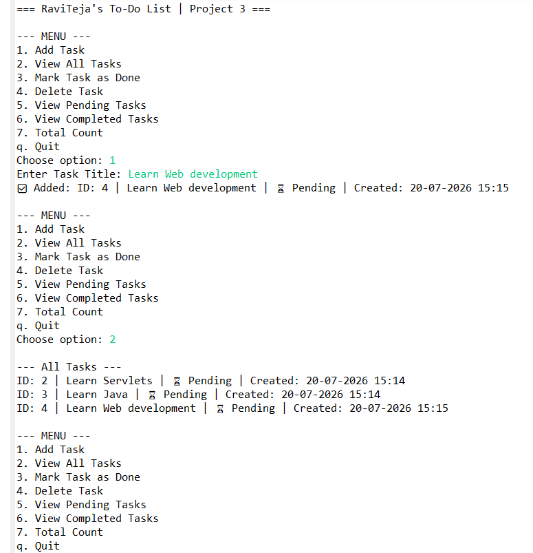
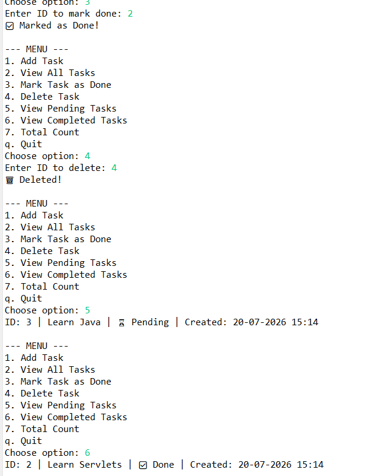
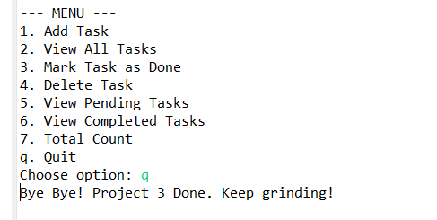

# ✅ 03 - To-Do CLI

> Project 3 of 100 by RaviTeja | Built with JDK 21, OOP, Streams, File Handling

A persistent Command-Line To-Do List Manager with file storage.

### ✨ Features
- Add Task with Timestamp
- View All / Pending / Completed (Stream API Filter)
- Mark as Done
- Delete Task
- Total Count
- Data Persists in `tasks.txt` after close!

### 🛠 Tech Stack
- Java 21, OOP, ArrayList
- Stream API, LocalDateTime
- File I/O (BufferedReader / FileWriter)


### 📸 Demo





### 🚀 How to Run
```bash
# Compile
mvn compile
# Run
mvn exec:java -Dexec.mainClass="com.raviteja.todo.Main"
